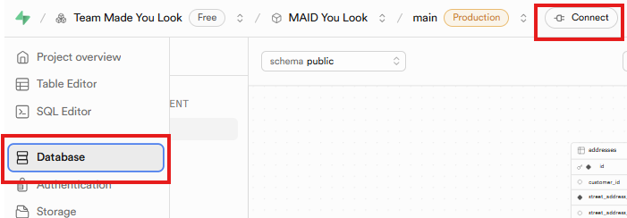
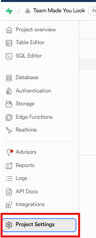

# 🚀 FastAPI Project Setup Guide

This guide will help you get the FastAPI server up and running using [`uv`](https://github.com/astral-sh/uv), a modern Python package manager and runtime.

---

## 📦 Step 1: Install `uv`

If you don't already have `uv` installed, you can install it with one of the following methods:

### MacOS / Linux

```bash
curl -Ls https://astral.sh/uv/install.sh | bash
```

### Windows (PowerShell)

```powershell
irm https://astral.sh/uv/install.ps1 | iex
```

Alternatively, check out the [official uv installation docs](https://github.com/astral-sh/uv#installation) for more options.

---

## 📥 Step 2: Install Dependencies

Install the project dependencies using:

```bash
uv add -r requirements.txt
```

This installs everything listed in `requirements.txt` and locks them using `uv.lock` for reproducibility.

---

## 🖥️ Step 3: Run the Server
### Start the Server
Start the FastAPI development server to run your server:

```bash
uv run uvicorn app.main:app --reload
```
> This will automatically create a `.venv` folder for your project if one doesn't already exist.

---

### Access the API 
Once the server is running, open your browser and navigate to:

```
http://127.0.0.1:8000
```

Or hold `Cmd` (Mac) or `Ctrl` (Windows/Linux) and click the link in your terminal.

### 📚 Access the API Docs (Swagger UI)

Once the server is running, FastAPI auto-generates interactive API docs at:
- Swagger UI: [`http://127.0.0.1:8000/docs`](http://127.0.0.1:8000/docs)
- ReDoc: [`http://127.0.0.1:8000/redoc`](http://127.0.0.1:8000/redoc)

#### To test an endpoint:
1. Go to `/docs`
2. Scroll to the endpoint you want to test
3. Click on it to expand
4. Click the "Try it out" button on the right
5. Enter any required parameters
6. Click "Execute"
7. Scroll down to view the response from the server

_This is super helpful during development to verify everything is working as expected._


---

## Step 4: 🔐 Configure Environment Variables

We use a `.env` file to manage configuration, like database URLs.
1. Go to **Supabase > Database > Connect**
  * 

2. In the modal that appears, look for the **Direct Connection** section at the top:
  * 

3. Use the `.env_example` file as a template to create your own `.env`. _Also mentioned in next step._

4. Set the `DATABASE_URL` environment variable using:
    - The **DB password**
    - The **hostname** shown under **Direct Connection**

---

## 🔑 Step 5. 🔐 Authentication (JWT) Setup

We're using Supabase's built-in authentication system to manage users (both customers and providers). Supabase issues a JWT (JSON Web Token) whenever a user signs in — we decode this token to identify the user in our FastAPI app.

### ➕ Add the JWT Secret

> To enable this, you must set the SUPABASE_JWT_SECRET in your .env file. This secret allows FastAPI to validate and decode incoming tokens securely.

To get your secret:
1. Go to your Supabase dashboard

2. Navigate to Project Settings → API



Use the service_role token that's provided to the right of this screenshot (just out of picture)


3. Look for the value under JWT Secret

4. Add it to your `.env` file as shown in the `.env_example`

>Note: This is the same secret Supabase uses to sign tokens, so your backend can safely verify them.


> ### ⚠️ Auth Routes Not Fully Functional Yet
> Endpoints like POST /customers, POST /providers, and any routes using /me rely on a valid Authorization header with a Supabase-issued JWT. 
> 
> ✅ These routes are secured and scoped to the logged-in user.
>
> ❌ However, full login functionality is not yet implemented — we’ll hook this up once we add Google Auth via Supabase.
>
Until then, customer and provider routes that depend on authentication won’t work through Swagger or normal API calls.
For now, we've temporarily faked a static UUID in development to simulate a logged-in user. You can adjust this inside:

### app/utils/auth.py

### ⚠️ TEMPORARY: This fakes a logged-in user for Swagger testing
```
async def get_current_user() -> UUID:
return UUID("3fa85f64-5717-4562-b3fc-2c963f66afa6")
```

---

## 🧱 Step 6. Database & Model Setup

We're using [Supabase](https://supabase.com/) (PostgreSQL) as our database.

- We define our database tables using `SQLModel`, a library that makes it easy to work with both Python data and SQL databases.
- Supabase hosts our Postgres database and helps manage performance behind the scenes.
- Settings like the database URL are stored in a `.env` file (as seen in the previous step).

### ⏱️ TimestampMixin

We've taken common fields like `id`, `created_at`, and `updated_at` and moved them into a reusable class called `TimestampMixin`.

This helps keep our models cleaner and avoids repeating the same code in every table.

```python
class TimestampMixin(SQLModel):
    id: Optional[uuid.UUID] = Field(default_factory=uuid4, primary_key=True)
    created_at: Optional[datetime] = Field(
        default=None,
        sa_column=Column(
            DateTime(timezone=True),
            server_default=text("(now() AT TIME ZONE 'utc')")
        )
    )
    updated_at: Optional[datetime] = Field(
        default=None,
        sa_column=Column(
            DateTime(timezone=True),
            server_default=text("(now() AT TIME ZONE 'utc')")
        )
    )
```

## 🧪 [Optional] Seed the Database
To test your database connection or seed example data (e.g. into the `providers` table), you can run the following:

```
uv run test_db.py
```

### ✅ You're Ready!

You can now build and test your FastAPI backend locally. Happy coding!

---

## 🧰 Dependency Management

### Add Dependencies
```
uv add dependency name
```
### Remove Dependencies
```
uv pip uninstall package-name
uv remove package-name
uv sync
```

---
## 🧯 Troubleshooting

### Can't connect to Supabase?

If you're seeing errors like:

```
psycopg2.OperationalError: could not translate host name ...
```

Make sure your internet connection isn't blocking access to Supabase's cloud database.

We've seen cases where **some Wi-Fi networks block or throttle access**, especially on public or secured networks. If you're stuck:

- Try switching to a mobile hotspot
- Check your firewall or DNS settings
- Make sure `.env` is loading the correct `DATABASE_URL` (i.e. print the string)
